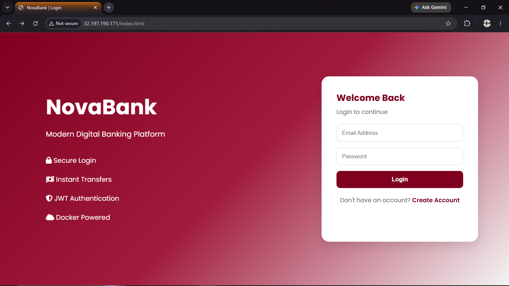
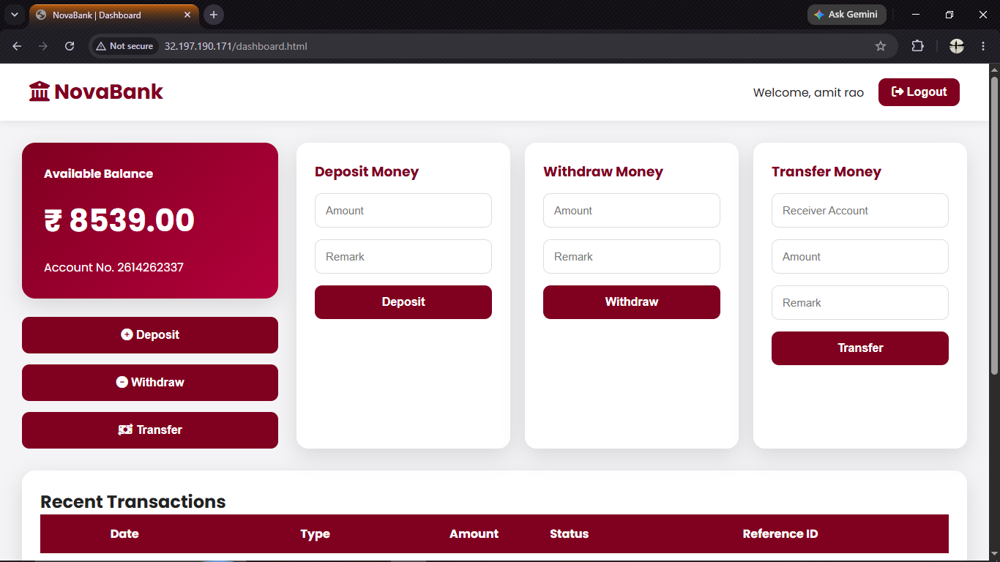
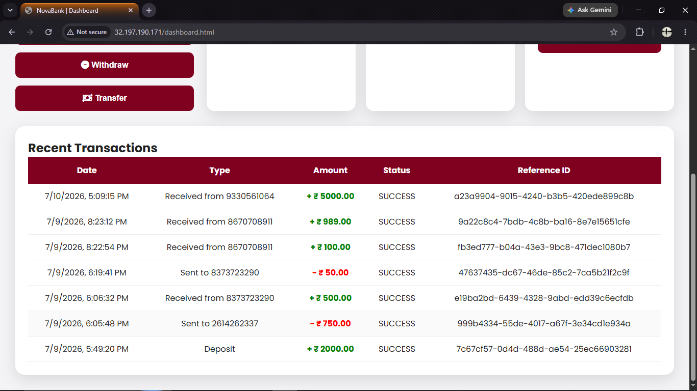
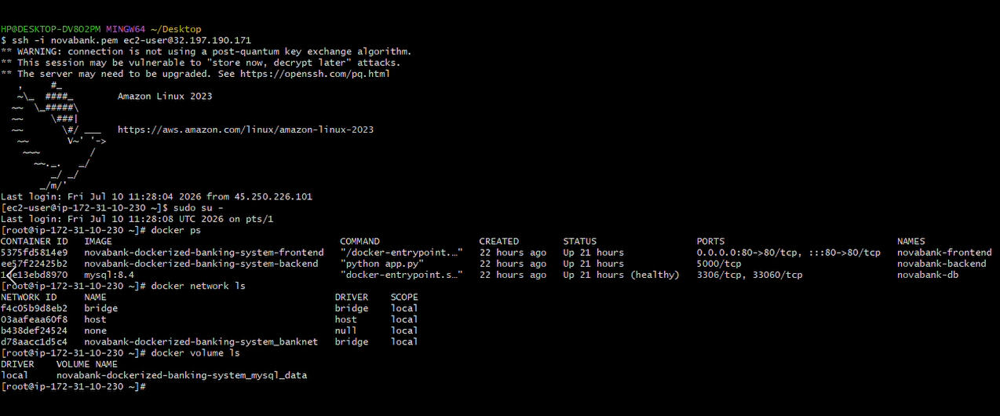
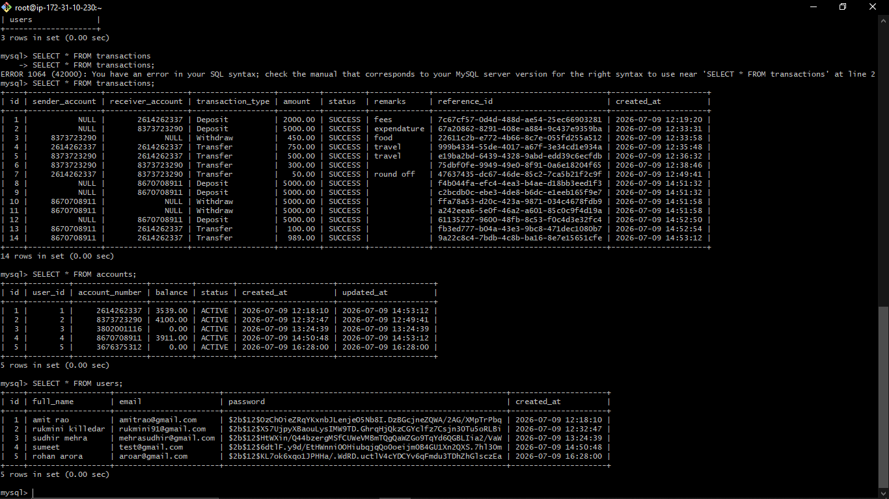

# 🏛️ NovaBank

> **Built. Dockerized. Deployed. 🚀**

A secure **3-tier banking application** featuring **JWT authentication**, **bcrypt password hashing**, **unique account & transaction IDs**, **real-time balance updates**, and **Dockerized deployment on AWS EC2**.

## 🎥 Demo

> 📸 Since GitHub doesn't support embedded video playback in this repository, a complete visual walkthrough is available in the **Screenshots** folder.

➡️ [View Screenshots](./screenshots)
---

## 👀 Sneak Peek

| Login | Dashboard |
|-------|-----------|
|  |  |

| Transactions | Docker | Database |
|--------------|---------|----------|
|  |  |  |

---

## ✨ Why it's cool

- 🔐 JWT Authentication
- 🛡️ bcrypt Password Hashing
- 🏦 Auto-generated 10-digit Account Numbers
- 🆔 Unique Transaction Reference IDs
- 💰 Deposit, Withdraw & Transfer Funds
- 📜 Live Transaction History
- 🐳 Dockerized 3-Tier Architecture
- ☁️ Deployed on AWS EC2

---

## 🏗️ Architecture

```text
Browser
   │
Nginx
   │
Flask API
   │
MySQL
```

---

## ⚙️ Tech Stack

**Frontend** • HTML • CSS • JavaScript

**Backend** • Python • Flask • JWT • bcrypt

**Database** • MySQL

**DevOps** • Docker • Docker Compose • Nginx • AWS EC2

---

## 🚀 Run Locally

```bash
git clone https://github.com/<username>/NovaBank-Dockerized-Banking-System.git

cd NovaBank-Dockerized-Banking-System

docker compose up --build
```


---

## 👨‍💻 Built by

**Swarup Lanjewar**

GitHub → https://github.com/swarup-lanjewar

---

### ⭐ If you enjoyed exploring this project, drop a star—it keeps the coffee brewing. ☕
